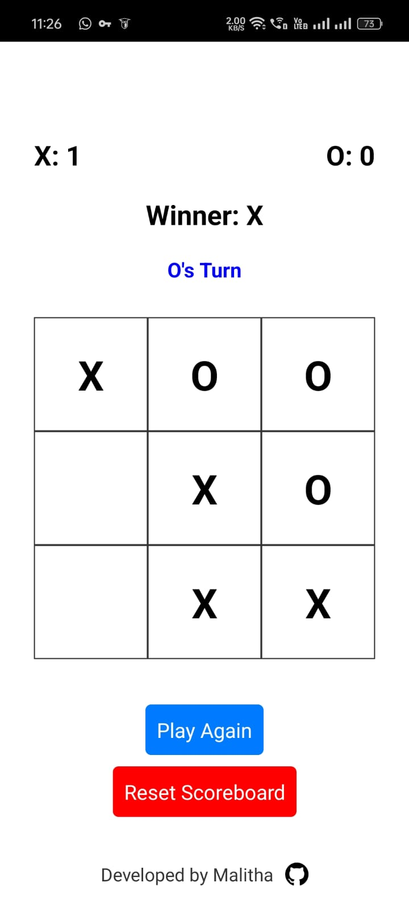

# XOX Game - React Native & Expo

This is a simple Tic-Tac-Toe game, also known as "XOX", developed using React Native and Expo. The game allows two players to play against each other on the same device.

## Features

- **Two-Player Game**: Players take turns to place their 'X' or 'O' on the board.
- **Scoreboard**: Keeps track of the score for both players.
- **Reset Functionality**: Reset the game board or the entire scoreboard at any time.
- **Responsive Design**: The game is designed to be visually appealing on both Android and iOS devices.
- **Developer Details**: Footer includes a link to the developer's GitHub profile.

## Installation

To run this app on your local machine, follow these steps:

1. **Clone the repository**:

   ```bash
   git clone https://github.com/Malitha-Gunathilaka/XOX-Game____React-Expo.git
   ```

2. **Navigate to the project directory**:

   ```bash
   cd XOX-Game____React-Expo
   ```

3. **Install the dependencies**:

   Make sure you have Node.js and npm installed. Then, install the necessary packages:

   ```bash
   npm install
   ```

4. **Start the project**:

   Start the Expo development server:

   ```bash
   npm start
   ```

   This will open the Expo Developer Tools in your browser. You can then run the app on an Android or iOS emulator, or on your physical device using the Expo Go app.

## Usage

- **Playing the Game**: Tap on any empty square to place your 'X' or 'O'. The game will automatically check for a winner or a tie.
- **Reset the Game**: Use the "Play Again" button to reset the board after a game.
- **Reset the Scoreboard**: Use the "Reset Scoreboard" button to clear the score for both players.

## Developer

This game was developed by [Malitha Gunathilaka](https://github.com/Malitha-Gunathilaka). You can check out more of my projects on [GitHub](https://github.com/Malitha-Gunathilaka).

## License

This project is licensed under the MIT License. See the [LICENSE](LICENSE) file for details.

## Screenshots

Include screenshots of your app to give users a preview of the game. You can add them here using the following markdown:

```markdown

```

## Acknowledgments

- **React Native**: The framework used to build the app.
- **Expo**: The toolchain used to develop and test the app.
- **Open Source Libraries**: Thanks to the community for maintaining and contributing to open source projects.

---

Thank you for checking out the XOX Game. Have fun playing!
